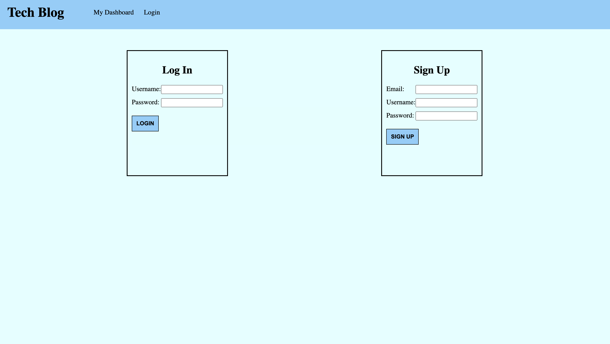
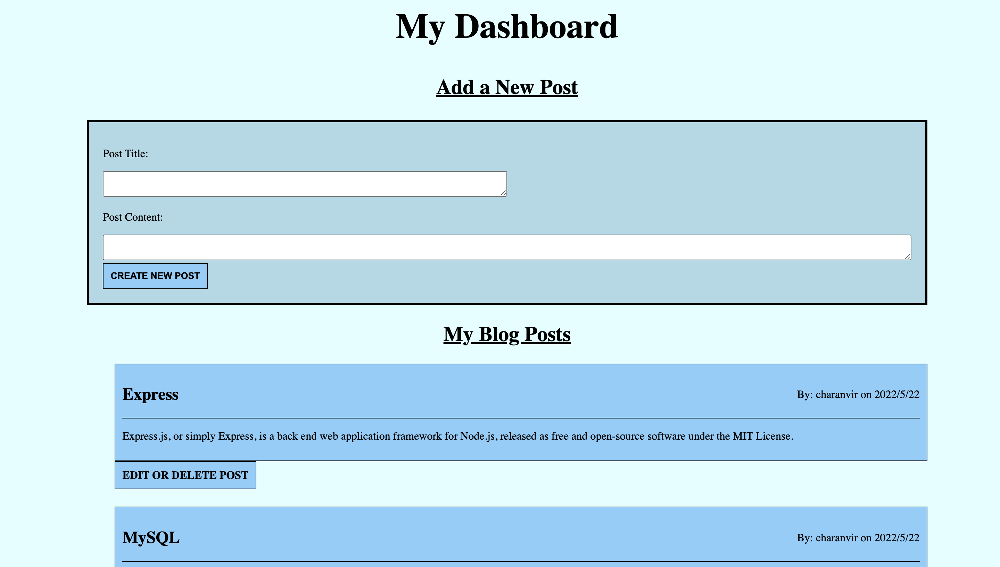

# BlueBlog


## Description
***

Tech Blog is a CMS-style blog site where developers can create accounts and write blog posts and comment on other users posts. Logged in users also have the ability to edit and delete their existing posts. The created, users, posts and comments are saved in the database, and can be accessed when viewing the page on a later occasion. The session expires after 15 minutes of inactivity, prompting the user to log in again and perform their regular tasks. 

Tech Blog is a Node.js express application that follows MVC architectural structure to organize and separate concerns. It is deployed to Heroku via the following link:
Tech Blog is a full stack application that uses handlebars.js as the templating language, and Sequelize as the ORM and express-session for authenication. 

## Installation
***

To install this application get the repository link from above, either via an HTTP or SSH link. 

```
git clone 
```

Once you have the repository cloned to your local machine, navigate to the root of the repository in your terminal.

```
npm install
```

This will install all the necessary dependencies that are needed for the application to run.

Then in the application's root directory, create a .env file. Within this file, enter the following lines, but with your MySQL username and password:

DB_NAME='tech_blog'

DB_USER='MySQL_USERNAME'

DB_PW='MySQL_PASSWORD'

This will establish a connection to MySQL and allow you to create the database on your local machine and in your MySQL account. The rest of the connection is already set up and ready to use!
Since the .env file is included in the .gitignore, there is no need to worry about security and privacy, when you push the repository to your GitHub, it will not be commited. In the server.js file, you can also put your own custom secret to ensure additional privacy. 

In the seeds folder, you can customize your own seed data that will be present when the application is ran. 

To seed the database, run: 

```
npm run seeds
```

To add the application to Heroku, run: 

```
heroku create
```

Then visit the heroku repository that is created and add the JAWS_DB add-on. This will allow the appropriate port to be used when deployed on Heroku

Once you have created the Heroku application, you can run the following command to seed the Heroku repository: 

```
heroku run node seeds/index.js
```

To deploy the application from the command line run: 

```
heroku open
```

## Usage
***

To use this application, navigate to the root of this repository in the terminal and enter either of the following commands:

```
npm start || node server.js
```

This will initialize the node server and allow you to access the database. Visit localhost:3001 to view the application.  

The following images show the application being used: 

### The applications homepage

 

***

### The login/signup page



***

### The dashboard for the logged in user




***


